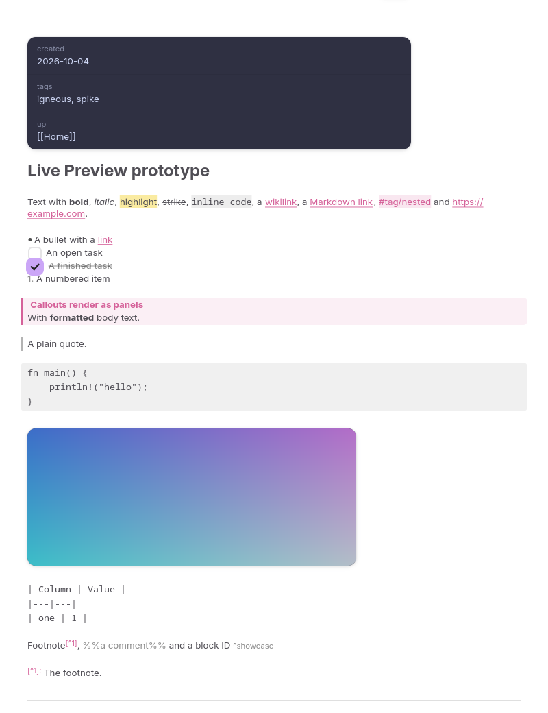
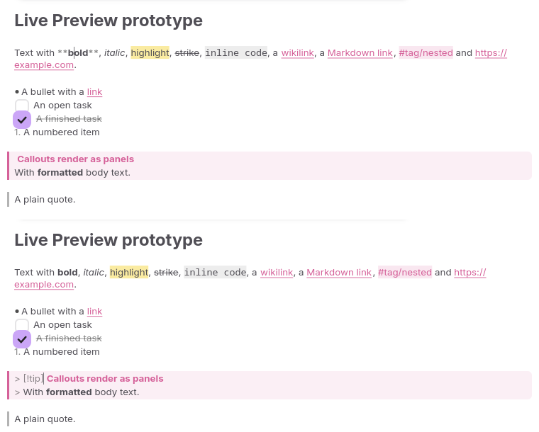

# 0001: Live Preview on GtkSourceView

- **Status:** Accepted, 2026-10-04. Two manual checks are still open: IME and Orca (see [below](#still-to-check-by-hand)).
- **Decides:** PROJECT.md D2 and the M0 gate.

## Context

Igneous needs Obsidian-style Live Preview: Markdown formatted as you type, with syntax revealed around the cursor. No GTK component does this. The plan was to build it on GtkSourceView 5 if a time-boxed prototype passed the M0 gate, and otherwise fall back to CodeMirror 6 in WebKitGTK.

Two existing GTK editors that hide Markdown syntax, Folio and Scribe, both avoid GTK's `invisible` tag property because of crashes, and shrink markers to zero size instead. The prototype tested both approaches.

## What was built

`spikes/live-preview/` is a throwaway binary.

- **Editor.** A `sourceview5::View` subclass driven by the presentation model from `igneous-markdown`. The buffer always holds the exact Markdown; nothing is inserted for display.
- **Restyling.** After every change the note is fully re-parsed. Each style tag's coverage is tracked as a range set, and only the differences are applied to the buffer. Cursor moves recompute concealment only.
- **Concealment.** Two interchangeable strategies:
  - `invisible`: GTK's `invisible` tag property;
  - `zerosize`: `scale 0.01` plus a near-transparent foreground.
- **Widgets over the text.** Checkboxes, images and the properties header are overlays added with `gtk_text_view_add_overlay`. Vertical space for them is reserved with `pixels-above-lines` / `pixels-below-lines` tags.
- **Block decorations.** Code backgrounds, callout panels, quote bars, bullets and rules are drawn in `snapshot_layer(BelowText)`.
- **Harness.** `--bench`, `--nav`, `--soak` and `--screenshot` modes. They ran in a headless GNOME compositor:

  ```
  dbus-run-session -- mutter --headless --wayland --no-x11 --virtual-monitor 1280x1200
  ```

| Nothing under the cursor | Cursor in **bold** (top) and in the callout (bottom) |
|---|---|
|  |  |

## Results

Test setup:

- **Note:** a generated 50 KiB note: frontmatter, headings, formatting, links, tags, ~160 tasks, callouts, code blocks, an image, tables, comments, footnotes and block IDs.
- **Build:** release.
- **Machine:** Ryzen 9 5950X, GTK 4.22.5, GtkSourceView 5.20, mutter virtual monitor at 60 Hz.

### Latency

300 inputs per phase, 30 ms apart. Times are in milliseconds, p50 / p95.

| Phase | Plain GtkSourceView: input→frame | Live Preview: input→frame | Live Preview: re-style per change | Live Preview: frame work (layout + paint) |
|---|---|---|---|---|
| Typing mid-note | 8.4 / 16.0 | 9.1 / 16.7 | 2.0 / 2.3 | 0.9 / 1.1 |
| Typing at top | 8.6 / 15.9 | 10.1 / 17.5 | 2.1 / 2.7 | 1.5 / 1.8 |
| Cursor down | 8.7 / 16.0 | 8.9 / 16.5 | 0.10 / 0.12 (reveal) | 1.4 / 2.1 |
| Cursor right | 8.1 / 14.7 | 10.3 / 17.6 | 0.09 / 0.11 (reveal) | 1.5 / 2.0 |

"Input→frame" runs from the input to the end of the next painted frame. At 60 Hz it is dominated by waiting for the frame, which is why plain GtkSourceView sits at 16 ms p95. Live Preview adds about 1–1.5 ms of CPU time per input.

### Cursor navigation

20,813 single steps through a 20 KiB note in each direction.

| | `zerosize` | `invisible` |
|---|---|---|
| Positions skipped moving right (logical) | **0** | 519 (e.g. ` **`, ` [[Wiki Link\|`) |
| Positions skipped moving left (visual) | **0** | 425 (e.g. ` ``` `, `](Note%2046.md),`) |
| Down arrow through all 861 display lines | reaches the end | reaches the end |
| Width of a hidden `**` | 0 px | — |
| Crashes | none | **aborts** (below) |

**The `invisible` crash.** The benchmark aborts with `Gtk-ERROR: Byte index N is off the end of the line`. The backtrace runs:

1. our `snapshot_layer` chains up to GtkSourceView's;
2. that calls `gtk_text_view_get_iter_at_location`;
3. which calls `gtk_text_iter_set_visible_line_index`, where it aborts.

The bug is in GTK's handling of invisible text, not in Igneous code. It matches GTK issue #6221 and Folio's and Scribe's experience.

### Soak

Randomised 10-minute editing sessions on the 50 KiB note, seed 20261004, `zerosize`. Operations:

- inserting Markdown snippets, including multi-byte text, frontmatter and fences;
- deleting text;
- placing the cursor and moving it by character, word, line, line end and paragraph;
- undo and redo;
- selections;
- switching between Live, Source and Reading.

After every operation the buffer text was checked against the model.

| Run | Operations | Invariant failures | Crashes | Note size |
|---|---|---|---|---|
| 1 | not recorded: aborted before reporting (same seed as run 2) | not recorded | **1, in pulldown-cmark** (see below) | 50 KiB, shrinking |
| 2 (after fix) | 5,056,500 | 0 | 0 | shrank from 50 KiB to 211 bytes (deletions outweighed insertions) |
| 3 (size kept large) | 547,480 | 0 | 0 | never below 30 KiB (30,738 bytes) |

During run 3, re-styling the ~30 KiB note took 1.2 ms p50 and 1.9 ms p95.

**The parser crash.** Run 1 aborted inside pulldown-cmark 0.13.4, not GTK:

1. `handle_wikilink` sliced `block_text[start..end]` with `start > end` on malformed input such as `![[] ]()]]`.
2. The panic unwound into a GTK signal handler, which can't unwind, so the process aborted.

This is upstream issue #1108. It's fixed on pulldown-cmark's main branch by PR #1111 (2026-07-08), but not in a release yet; 0.13.4 is from 2026-05-20.

`igneous-markdown` now parses under `catch_unwind`. If the parser panics, it re-parses without the wikilink extension and marks the document as degraded. Run 2 hit the same bug at operation 4,956,845 and carried on without interruption.

A regression test pins the upstream reproducer. It will fail once a fixed release is adopted, as a reminder to drop the note.

## Gate assessment

| Criterion | Result |
|---|---|
| p95 keystroke→frame < 16 ms | **Not met as written:** 16.5–17.6 ms. As written, the criterion is unreachable. Plain GtkSourceView measures 14.7–16.0 ms p95 under the same 60 Hz pacing; what Live Preview adds is 1–1.5 ms of CPU per input. Replaced with: *within one frame of plain GtkSourceView, and under 8 ms of CPU per input.* Met: about 2 ms re-styling plus 1–2 ms frame work. |
| Buffer text always equals the source | **Met:** checked after every benchmark phase, navigation run and soak operation. |
| No stuck or skipped cursor positions | **Met with `zerosize`:** 0 skips in either direction. Not met with `invisible`. |
| IME composition works | **Not tested.** The headless session has no input method. Manual check needed. |
| No crashes in a 10-minute scripted session | **Met** with `zerosize`. The one crash found was in pulldown-cmark and is now contained. `invisible` aborts within the first minute of the benchmark. |
| Orca reads the note | **Not tested.** Manual check needed. |

## Decision

**Build Live Preview natively on GtkSourceView 5, hiding markers by shrinking them to zero size.** M4 proceeds on this basis; the WebKit/CodeMirror fallback isn't needed.

The `invisible` tag property must not be used anywhere in the editor.

## What M4 (`igneous-editor`) must carry over

1. **Hiding markers.** Use `scale = 0.01` with a foreground alpha of 1/65535. Pango treats an alpha of 0 as unset, which leaves the text visible.
2. **Reveal on touch.** Markers show while the cursor or selection touches the element, ends included. So the cursor never stops inside hidden markers and needs no skipping logic. Only never-revealed regions (the frontmatter under the properties header) need a guard that moves the cursor out.
3. **No `iter_location` per frame.** It re-shapes the line's text with HarfBuzz. Calling it every frame for each nearby checkbox and bullet cost about 11 ms per frame. Switching to `line_yrange`, which uses cached line heights, brought frame work from about 12 ms to about 1 ms. Horizontal positions should be cached per line and recomputed only when the line changes. The spike approximates list indents instead.
4. **Overlay widgets only near the viewport.** GTK re-allocates every text view child on each layout. Create overlays as they scroll into view and drop them as they leave. Cache image sizes so space can be reserved without a widget.
5. **Strip tags from inserted text.** GTK gives inserted text the tags around it. Strip Igneous's tags from each inserted range so the range-set model stays exact. Then a full re-parse plus a tag diff takes about 2 ms for 50 KiB.
6. **Ghost markers under widgets.** Markers under checkboxes, bullets and rules are made transparent but keep their width, so the widget has room.
7. **Coordinates.** `snapshot_layer` draws in buffer coordinates, the same space `line_yrange` uses.
8. **Running the harness.** Measurements need a real compositor. Broadway's frame clock stalls with no browser connected. Headless mutter works and can run in CI.
   - Turn off `gtk-error-bell` first. Headless mutter plays the bell through the desktop's speakers, and the soak test hits the ends of the buffer constantly.

Still to do in M4:

- rendered tables and math;
- note embeds;
- callout icons and default titles;
- a measured list indent;
- an editable properties header (its card is also mis-themed in light mode);
- re-creating tags when switching between light and dark at runtime;
- moving to a pulldown-cmark release containing PR #1111, then removing the degraded-parse note;
- making sure screen readers don't announce hidden syntax awkwardly.

## Still to check by hand

```sh
cargo run --release -p live-preview-spike                 # sample note
cargo run --release -p live-preview-spike -- note.md      # any note
```

- **IME:** type with an input method (IBus, e.g. Japanese or Chinese, or compose-key sequences) inside **bold** text and inside a wikilink. Composition should work and the result should land as expected.
- **Orca:** start Orca, move through a note and check what is read. The hidden Markdown syntax is still in the buffer, so it may be announced.
- **Feel:** whether revealing and hiding as the cursor moves feels right compared with Obsidian.
